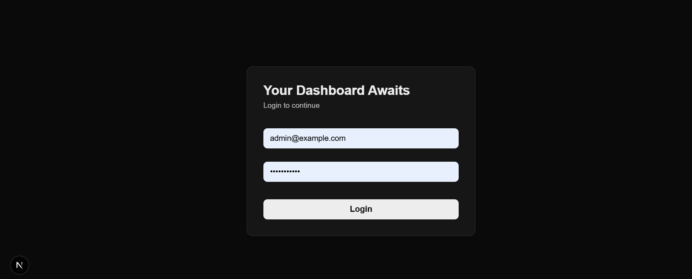
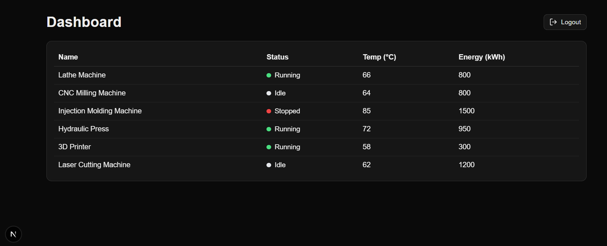
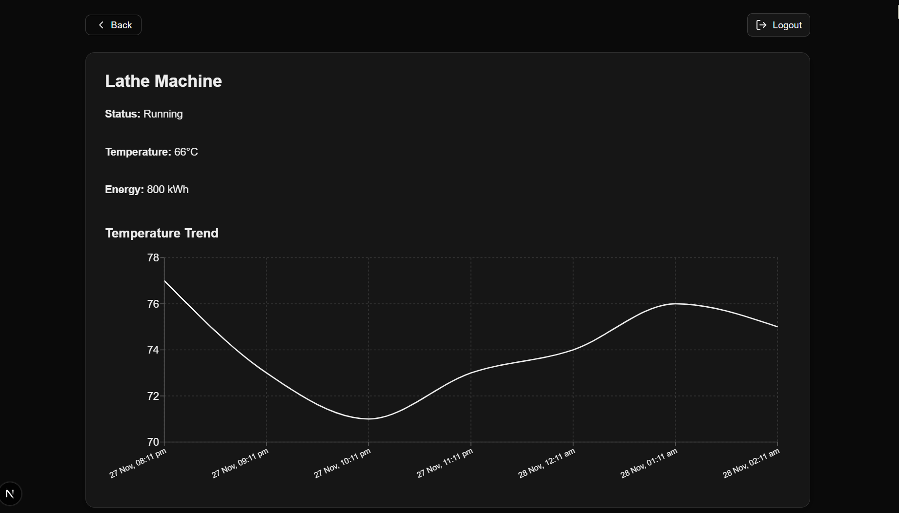

# 🚀 Machines Dashboard – Full Setup Guide

A real-time dashboard to monitor machine status, temperature updates, and analytics using **Next.js (Frontend)** + **NestJS (Backend)** + **MongoDB**.

---

## Login Credentials

Use the following static credentials to access the application:

**Email:** admin@example.com  
**Password:** password123

## 📦 1. Clone the Repository

```bash
git clone https://github.com/Nandakiran007/Machines-Dashboard.git
cd Machines-Dashboard
```

## 🖥️ Frontend – Next.js (Port: 3000)

### 2. Install Dependencies

```bash
cd frontend
npm install
```

### 3. Start the Development Server

```bash
npm run dev
```

Frontend will run at: http://localhost:3000

### ⚙️ (Optional) Environment Variables (Frontend)

Create a .env.local inside frontend/:

```bash
NEXT_PUBLIC_BACKEND_URL=http://localhost:3001
NEXT_PUBLIC_WS_URL=http://localhost:3001

```

(Default values exist, so this step is optional.)

### 🗄️ Database Setup – MongoDB

This project requires MongoDB.

You can either:

🔹 Install MongoDB locally

https://www.mongodb.com/try/download/community

OR

🔹 Use MongoDB Atlas

https://www.mongodb.com/atlas/database

## ⚙️ Backend – NestJS (Port: 3001)

### 1. Install Dependencies

```bash
cd backend
npm install
```

### 2. Start the Backend Server

```bash
npm run dev
```

Backend will run at: http://localhost:3001

### 🧩 (Optional) Environment Variables (Backend)

Create a .env file inside backend/:

```bash
PORT=3001
MONGODB_URI=mongodb://localhost:27017/machinesdb
JWT_SECRET=your_jwt_secret_key
```

(Default values exist.)

### 📊 Populate Initial Database Values

Run the seed script inside the backend folder:

```bash
cd backend
node populateDb.js
```

This will insert sample machine data into your MongoDB database.

### 🛠 Scripts

#### Frontend

```bash
npm run dev     # Start frontend
npm run build   # Build
npm start       # Production mode
```

#### Backend

```bash
npm run dev     # Start dev server
npm run build   # Build NestJS
npm start       # Run built server
```

## 📸 Screenshots

### Login Page



### Dashboard



### Machine Info


